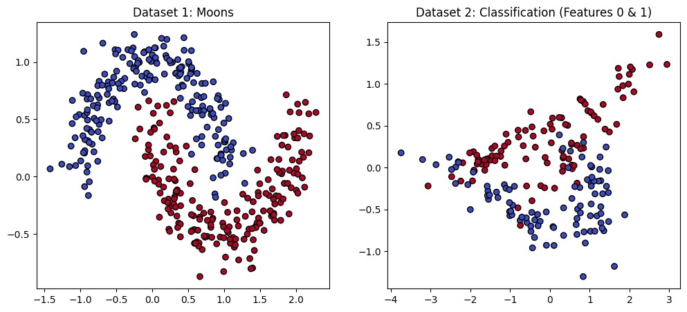
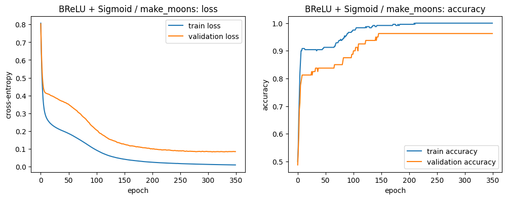
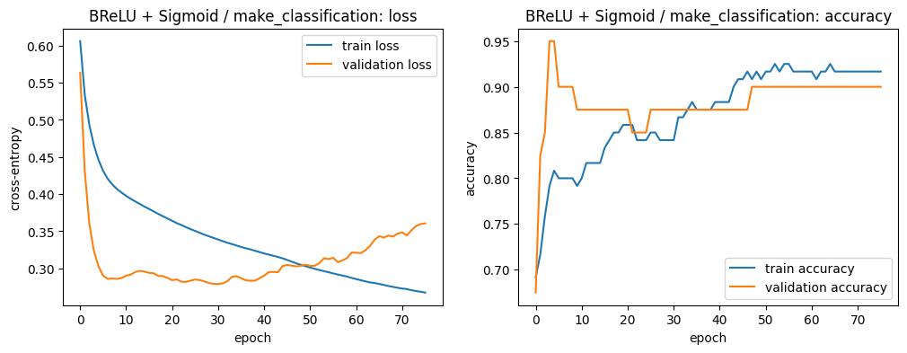
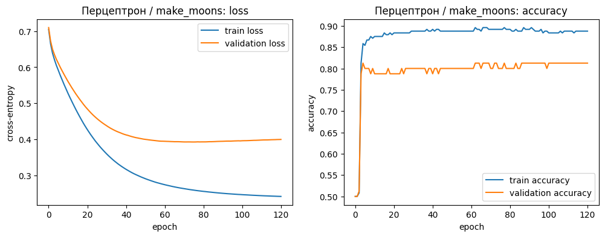
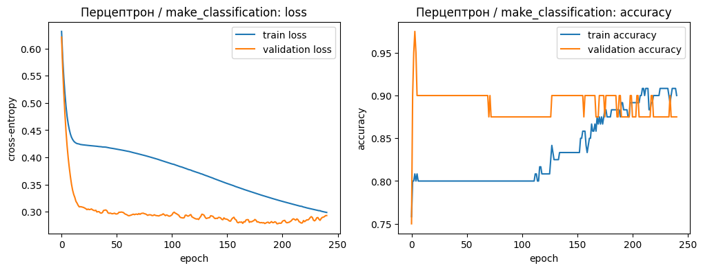

> **САНКТ-ПЕТЕРБУРГСКИЙ НАЦИОНАЛЬНЫЙ ИССЛЕДОВАТЕЛЬСКИЙ УНИВЕРСИТЕТ  
> ИТМО**

**Дисциплина**: Продвинутые методы оптимизации

**Отчет по Лабораторной работе номер 4**

**«Реализация нейронной сети для бинарной классификации без использования фреймворков»**

**Выполнили:**

Васюнина София, Ису: 465370, группа: J3214

Автономова Ксения, Ису: 464931, группа: J3213

Лорс Алина, Ису: 474321, группа: J3214

> Санкт-Петербург
>
> 2026 г.

---

# Лабораторная работа №4

## 1. Постановка задачи

В лабораторной работе необходимо было самостоятельно реализовать нейронную сеть для бинарной классификации без использования фреймворков глубокого обучения. По заданию требовалось построить односвязную сеть, в основе которой используется связка **BReLU + Sigmoid**, реализовать обучение с функцией потерь **cross-entropy**, а также реализовать оптимизаторы **SGD** с регулируемым размером батча и модификацию **Adam**, объединяющую идеи Momentum/Nesterov и AdaGrad/RMSProp.

Также требовалось сгенерировать два датасета, обучить модели, подобрать гиперпараметры, оценить качество на тестовой выборке и сравнить результаты с перцептроном с одним скрытым слоем.

---

## 2. Использованные датасеты

В работе использовались два датасета из `sklearn.datasets`.

Первый датасет был сгенерирован следующим образом:

```python
X, y = make_moons(n_samples=400, noise=0.15, random_state=474321)
```

Второй датасет был сгенерирован следующим образом:

```python
X, y = make_classification(
    n_samples=200,
    n_features=5,
    n_redundant=2,
    random_state=474321,
    n_informative=2,
    n_clusters_per_class=2,
    n_classes=2
)
```

`random_state = 474321` соответствует используемому в ноутбуке номеру ИСУ.

Визуализация исходных данных представлена ниже.



*Рисунок 1 — визуализация датасетов `make_moons` и `make_classification`.*

Датасет `make_moons` является нелинейно разделимым: объекты двух классов образуют две дугообразные области. Поэтому для хорошей классификации требуется нелинейная модель. Датасет `make_classification` имеет 5 признаков, из которых 2 являются информативными, а 2 — избыточными. На рисунке показана проекция только по первым двум признакам.

---

## 3. Подготовка данных

Для каждого датасета данные были разделены на три части:

| Выборка | Доля данных | Назначение |
|---|---:|---|
| Train | 60% | обучение параметров модели |
| Validation | 20% | выбор лучшей модели и гиперпараметров |
| Test | 20% | финальная проверка качества |

Размеры выборок:

| Датасет | Train | Validation | Test | Всего |
|---|---:|---:|---:|---:|
| `make_moons` | 240 | 80 | 80 | 400 |
| `make_classification` | 120 | 40 | 40 | 200 |

Перед обучением признаки масштабировались с помощью `StandardScaler`. Масштабирование выполнялось корректно: среднее и стандартное отклонение считались только на тренировочной выборке, после чего это же преобразование применялось к validation и test. Это важно, так как тестовая выборка не должна влиять на обучение модели.

---

## 4. Реализованная сеть BReLU + Sigmoid

Основная сеть из пункта 4 имела следующую архитектуру:

```text
Input -> Dense -> BReLU -> Dense -> Sigmoid -> Output
```

Первый полносвязный слой преобразует входные признаки в скрытое представление. Затем применяется функция активации **BReLU**. На выходе используется один нейрон с функцией активации **Sigmoid**, поэтому результат можно интерпретировать как вероятность принадлежности объекта к классу 1.

Прямой проход модели:

```text
z1 = XW1 + b1
h1 = BReLU(z1)
z2 = h1W2 + b2
y_pred = Sigmoid(z2)
```

Функция BReLU является ограниченной версией ReLU:

```text
BReLU(x) = min(a, max(0, x))
```

В работе использовалось ограничение `a = 6.0`. Такая активация пропускает положительные значения, зануляет отрицательные и ограничивает слишком большие значения сверху. Это делает обучение более устойчивым.

Для бинарной классификации использовалась функция потерь **binary cross-entropy**:

```text
L = -mean(y * log(y_pred) + (1 - y) * log(1 - y_pred))
```

---

## 5. Реализованные оптимизаторы

В работе были реализованы два способа обновления параметров.

### 5.1. SGD

Обычный стохастический градиентный спуск обновляет параметры по правилу:

```text
theta = theta - lr * grad
```

В реализации можно было регулировать размер батча. Были использованы батчи размером 16 и 32. Мини-батчевое обучение позволяет обновлять веса чаще, чем при полном градиентном спуске, и при этом дает более устойчивые шаги, чем обновление по одному объекту.

### 5.2. NAdam как модификация Adam

Также была реализована модификация Adam — **NAdam**. Этот метод объединяет:

- идею Momentum/Nesterov, то есть накопление направления движения;
- идею AdaGrad/RMSProp, то есть адаптивное масштабирование шага для каждого параметра.

Для каждого параметра хранились первый и второй моменты градиента:

```text
m = beta1 * m + (1 - beta1) * grad
v = beta2 * v + (1 - beta2) * grad^2
```

После коррекции смещения выполнялось адаптивное обновление параметров. Такой оптимизатор обычно обучает модель стабильнее, чем обычный SGD, потому что учитывает историю градиентов и подбирает масштаб шага для разных параметров.

---

## 6. Подбор гиперпараметров

Для каждой модели и каждого датасета перебирались несколько комбинаций гиперпараметров:

| Hidden units | Learning rate | Batch size | Optimizer |
|---:|---:|---:|---|
| 8 | 0.010 | 16 | `nadam` |
| 16 | 0.010 | 32 | `nadam` |
| 16 | 0.005 | 32 | `nadam` |
| 32 | 0.005 | 32 | `nadam` |
| 16 | 0.050 | 32 | `sgd` |

Лучшая модель выбиралась по минимальному значению ошибки на валидационной выборке. Тестовая выборка не использовалась при подборе гиперпараметров. Она применялась только для финальной оценки уже выбранной модели.

Также использовался механизм сохранения лучшего состояния модели по `validation loss`. Если модель начинала ухудшаться на валидационной выборке, в конце восстанавливались веса той эпохи, где значение `validation loss` было минимальным.

---

# 7. Результаты модели BReLU + Sigmoid

## 7.1. Датасет make_moons

Лучшая конфигурация для `make_moons`:

| Параметр | Значение |
|---|---:|
| Optimizer | `nadam` |
| Hidden units | 16 |
| Learning rate | 0.005 |
| Batch size | 32 |
| Best epoch | 309 |
| Validation loss | 0.0830 |

Графики обучения:



*Рисунок 2 — обучение модели BReLU + Sigmoid на датасете `make_moons`.*

По графику видно, что train loss и validation loss постепенно уменьшаются. Validation accuracy достигает значения около 0.96 и далее остается стабильной. Это говорит о том, что модель смогла выучить нелинейную структуру данных и не деградировала на валидационной выборке.

Качество на выборках:

| Метрика | Значение |
|---|---:|
| Train accuracy | 1.0000 |
| Validation accuracy | 0.9625 |
| Test accuracy | 0.9625 |
| Test precision | 0.9512 |
| Test recall | 0.9750 |
| Test F1-score | 0.9630 |

Матрица ошибок на тестовой выборке:

```text
[[38,  2],
 [ 1, 39]]
```

Модель допустила 3 ошибки на 80 тестовых объектах. Это хороший результат для нелинейного датасета с шумом.

---

## 7.2. Датасет make_classification

Лучшая конфигурация для `make_classification`:

| Параметр | Значение |
|---|---:|
| Optimizer | `nadam` |
| Hidden units | 16 |
| Learning rate | 0.010 |
| Batch size | 32 |
| Best epoch | 31 |
| Validation loss | 0.2790 |

Графики обучения:



*Рисунок 3 — обучение модели BReLU + Sigmoid на датасете `make_classification`.*

На графике видно, что validation loss быстро уменьшается в начале обучения, а затем начинает постепенно расти. Это означает, что после некоторого количества эпох модель начинает лучше подстраиваться под train, но не улучшает качество на validation. Поэтому выбор лучшей эпохи по минимальному `validation loss` был необходим.

Качество на выборках:

| Метрика | Значение |
|---|---:|
| Train accuracy | 0.8417 |
| Validation accuracy | 0.8750 |
| Test accuracy | 0.9250 |
| Test precision | 0.9474 |
| Test recall | 0.9000 |
| Test F1-score | 0.9231 |

Матрица ошибок на тестовой выборке:

```text
[[19,  1],
 [ 2, 18]]
```

Модель допустила 3 ошибки на 40 тестовых объектах. Несмотря на небольшой размер тестовой выборки, итоговые метрики показывают хорошее качество классификации.

---

# 8. Перцептрон с одним скрытым слоем

Для выполнения пункта 5 был реализован перцептрон с одним скрытым слоем. Его архитектура:

```text
Input -> Dense -> Sigmoid -> Dense -> Sigmoid -> Output
```

Главное отличие от модели BReLU + Sigmoid состоит в том, что в скрытом слое используется не BReLU, а Sigmoid. После этого для перцептрона был повторен тот же процесс: разделение данных, обучение, подбор гиперпараметров по validation loss и проверка на test.

---

## 8.1. Датасет make_moons

Лучшая конфигурация для `make_moons`:

| Параметр | Значение |
|---|---:|
| Optimizer | `sgd` |
| Hidden units | 16 |
| Learning rate | 0.050 |
| Batch size | 32 |
| Best epoch | 76 |
| Validation loss | 0.3923 |

Графики обучения:



*Рисунок 4 — обучение перцептрона на датасете `make_moons`.*

По графику видно, что train loss снижается, но validation loss перестает заметно улучшаться и остается около 0.39. Validation accuracy держится примерно на уровне 0.80. Это означает, что перцептрон хуже справился с нелинейной структурой двух «лун», чем модель с BReLU.

Качество на выборках:

| Метрика | Значение |
|---|---:|
| Train accuracy | 0.8917 |
| Validation accuracy | 0.8000 |
| Test accuracy | 0.8875 |
| Test precision | 0.8605 |
| Test recall | 0.9250 |
| Test F1-score | 0.8916 |

Матрица ошибок на тестовой выборке:

```text
[[34,  6],
 [ 3, 37]]
```

Перцептрон допустил 9 ошибок на 80 тестовых объектах. Это заметно хуже, чем результат BReLU + Sigmoid на том же датасете.

---

## 8.2. Датасет make_classification

Лучшая конфигурация для `make_classification`:

| Параметр | Значение |
|---|---:|
| Optimizer | `nadam` |
| Hidden units | 16 |
| Learning rate | 0.010 |
| Batch size | 32 |
| Best epoch | 196 |
| Validation loss | 0.2777 |

Графики обучения:



*Рисунок 5 — обучение перцептрона на датасете `make_classification`.*

Validation loss остается низким и находится около 0.28–0.30. Значения accuracy на validation колеблются, что объясняется небольшим размером валидационной выборки: всего 40 объектов.

Качество на выборках:

| Метрика | Значение |
|---|---:|
| Train accuracy | 0.8833 |
| Validation accuracy | 0.8750 |
| Test accuracy | 0.9250 |
| Test precision | 0.9474 |
| Test recall | 0.9000 |
| Test F1-score | 0.9231 |

Матрица ошибок на тестовой выборке:

```text
[[19,  1],
 [ 2, 18]]
```

На этом датасете перцептрон показал такое же тестовое качество, как и модель BReLU + Sigmoid: 3 ошибки на 40 тестовых объектах.

---

# 9. Сравнение лучших моделей

| Датасет | Модель | Val loss | Test accuracy | Precision | Recall | F1-score | Ошибок на test |
|---|---|---:|---:|---:|---:|---:|---:|
| `make_moons` | BReLU + Sigmoid | 0.0830 | 0.9625 | 0.9512 | 0.9750 | 0.9630 | 3 из 80 |
| `make_moons` | Перцептрон | 0.3923 | 0.8875 | 0.8605 | 0.9250 | 0.8916 | 9 из 80 |
| `make_classification` | BReLU + Sigmoid | 0.2790 | 0.9250 | 0.9474 | 0.9000 | 0.9231 | 3 из 40 |
| `make_classification` | Перцептрон | 0.2777 | 0.9250 | 0.9474 | 0.9000 | 0.9231 | 3 из 40 |

На датасете `make_moons` лучшей оказалась модель **BReLU + Sigmoid**. Она дала `test_accuracy = 0.9625`, в то время как перцептрон получил `test_accuracy = 0.8875`. Разница составляет 0.075, то есть 7.5 процентных пункта.

На датасете `make_classification` обе модели показали одинаковое качество на тестовой выборке: `test_accuracy = 0.9250` и `F1-score = 0.9231`. При этом validation loss у перцептрона немного ниже: 0.2777 против 0.2790, но разница очень мала, поэтому модели можно считать сопоставимыми.

---

# 10. Вывод

В ходе лабораторной работы была вручную реализована нейронная сеть для бинарной классификации без использования фреймворков глубокого обучения. Были реализованы полносвязные слои, функции активации BReLU и Sigmoid, прямое распространение, обратное распространение ошибки, binary cross-entropy, SGD с регулируемым размером батча и модификация Adam в виде NAdam.

Для проверки моделей использовались два датасета: `make_moons` и `make_classification`. Данные были разделены на тренировочную, валидационную и тестовую выборки в пропорции 60%/20%/20%. Гиперпараметры выбирались по минимальному значению `validation loss`, а тестовая выборка использовалась только для итоговой проверки качества.

Основные результаты:

1. На датасете `make_moons` лучше всего сработала модель **BReLU + Sigmoid**. Она достигла `test_accuracy = 0.9625` и допустила только 3 ошибки из 80.
2. Перцептрон с одним скрытым слоем на `make_moons` показал более слабый результат: `test_accuracy = 0.8875` и 9 ошибок из 80.
3. На датасете `make_classification` обе модели показали одинаковую тестовую точность `0.9250` и одинаковый `F1-score = 0.9231`.
4. Оптимизатор NAdam чаще оказывался лучшим по validation loss, так как использует как момент, так и адаптивное масштабирование шага.
5. Сеть BReLU + Sigmoid лучше подходит для нелинейного датасета `make_moons`, а для `make_classification` обе архитектуры работают примерно одинаково хорошо.

Итоговый вывод: задание выполнено полностью. Реализованные модели успешно решают задачу бинарной классификации, а наилучший результат был получен у модели **BReLU + Sigmoid** на датасете `make_moons`.
